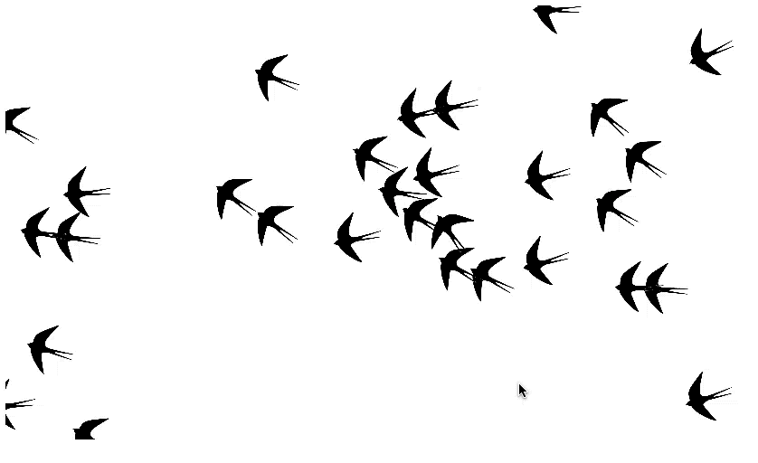
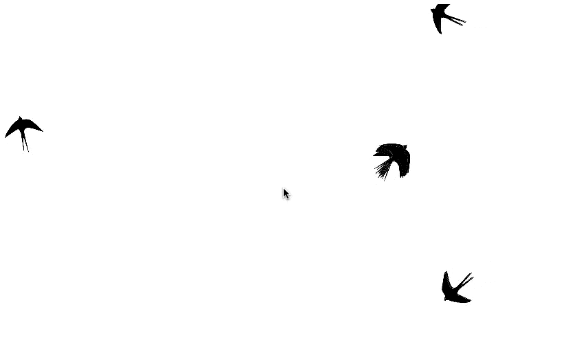

# flocker

Author: Sidharth Mishra &lt;sidmishraw@gmail.com&gt;, Gaurav Gupta &lt;gaurav.gupta@sjsu.edu&gt;

`flocker` is flocking simulation application using [p5.js](https://p5js.org/). The birds shown are Swallows.

## Demo#1 - Normal

For this demo, the variables are set to the following values:

* maxWrapAroundWidth = 816
* maxWrapAroundHeight = 480
* maxVelocity = 2.0
* maxAcceleration = 0.03
* desiredSeparation = 50.0
* desiredAlignment = 50.0
* desiredCohesion = 50.0
* separationWeight = 3.0
* alignmentWeight = 2.0
* cohesionWeight = 2.0

## Demo#2 - High separation

For this demo, the variables are ser to the following values:

* maxWrapAroundWidth = 816
* maxWrapAroundHeight = 480
* maxVelocity = 2.0
* maxAcceleration = 0.03
* desiredSeparation = 50.0
* desiredAlignment = 50.0
* desiredCohesion = 50.0
* separationWeight = 2.5
* alignmentWeight = 1.0
* cohesionWeight = 1.0

## Demo#3 - High alignment

For this demo, the variables are ser to the following values:

* maxWrapAroundWidth = 816
* maxWrapAroundHeight = 480
* maxVelocity = 2.0
* maxAcceleration = 0.03
* desiredSeparation = 50.0
* desiredAlignment = 50.0
* desiredCohesion = 50.0
* separationWeight = 1.0
* alignmentWeight = 2.5
* cohesionWeight = 1.0

## Demo#4 - High cohesion

For this demo, the variables are ser to the following values:

* maxWrapAroundWidth = 816
* maxWrapAroundHeight = 480
* maxVelocity = 2.0
* maxAcceleration = 0.03
* desiredSeparation = 50.0
* desiredAlignment = 50.0
* desiredCohesion = 50.0
* separationWeight = 1.0
* alignmentWeight = 1.0
* cohesionWeight = 2.5

## References

[1] D. Shiffman, "Flocking", [Online] Website: https://processing.org/examples/flocking.html

[2] G. Kogan, "P5JS transformations", [Online] Website: http://genekogan.com/code/p5js-transformations/

[3] C. W. Reynolds, "Steering behaviors for autonomous characters", in Game developers conf., 1999, vol.1999, pp. 763-782

[4] J. Fantauzza, “Flock”, Exploratorium exhibit [Online] Website: http://www.interwebjill.info/work/flock.html

[5] Wikimedia, “Flocking (behavior)”, Wikipedia [Online] Website: https://en.wikipedia.org/wiki/Flocking_(behavior)

[6] P5JS reference, [Online] Website: https://p5js.org/reference
